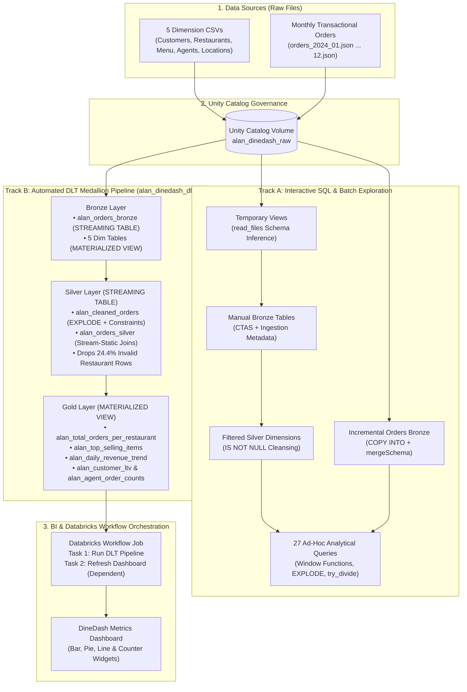
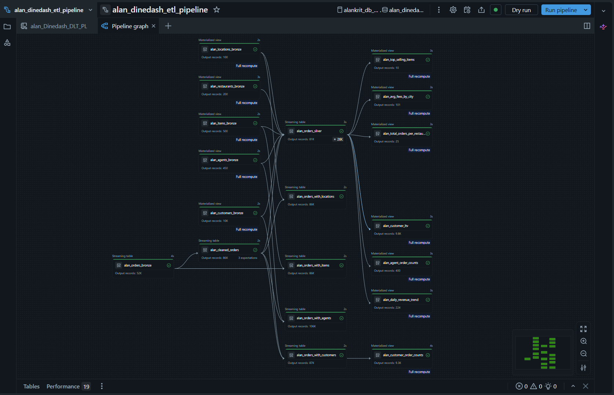
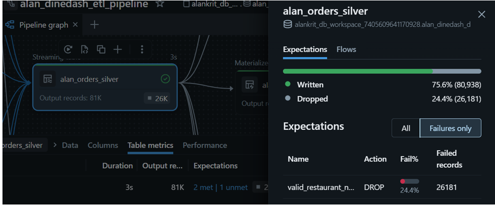
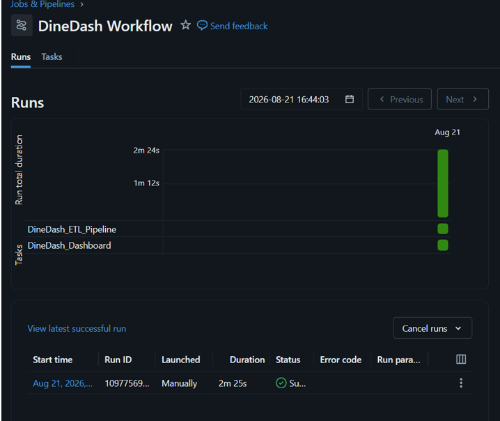
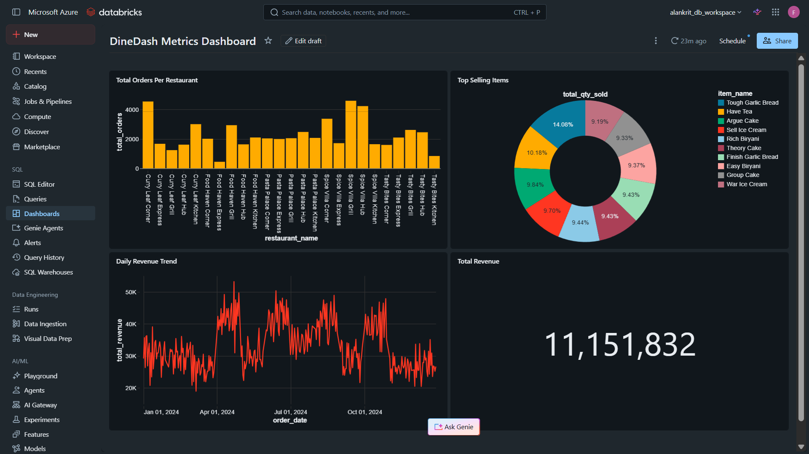

# 🍔 DineDash: End-to-End Food Delivery Data Lakehouse on Databricks

An enterprise-grade Data Engineering project built under **ACCENTURE DataEngineer Training** on **Azure Databricks** implementing the **Medallion Architecture (Bronze, Silver, Gold)** using **Unity Catalog**, **Delta Live Tables (DLT)**, **Auto Loader**, and **Databricks Workflows**

---

## 📌 Project Overview & Business Problem
**DineDash** is a rapidly growing food delivery platform facing operational bottlenecks due to fragmented data across orders, customer profiles, restaurant menus, and delivery agent logs.

This project unifies batch dimension datasets (CSV) and continuous transactional order streams (JSON) into a centralized Lakehouse to:
- Automate real-time data cleansing and schema enforcement.
- Track restaurant order volumes, item-level revenue contributions, and customer lifetime value (LTV).
- Orchestrate zero-touch BI dashboard updates as new monthly data arrives.

---

## 🏗️ Architecture & Tech Stack

- **Cloud Platform:** Azure Databricks
- **Governance & Storage:** Unity Catalog Volumes (`/Volumes/.../alan_dinedash_raw`)
- **Ingestion Engines:** `COPY INTO` (Batch Incremental) & Auto Loader (`STREAM READ_FILES`)
- **ETL & Declarative Pipeline:** Delta Live Tables (DLT) (`STREAMING TABLE` & `MATERIALIZED VIEW`)
- **Orchestration:** Databricks Workflows (Multi-Task DAG)
- **Analytics & BI:** Databricks SQL (27 Analytical Queries + Automated Metrics Dashboard)

### Medallion Layer Design
1. **Bronze Layer (Raw Ingestion):**
   - Ingests 5 static dimension CSVs (`customers`, `restaurants`, `locations`, `delivery_agents`, `menu_items`) and streaming JSON `orders`.
   - Captures audit metadata (`ingestion_time`, `source_file_name`) and supports schema evolution (`mergeSchema = 'true'`).
2. **Silver Layer (Cleansed & Enriched):**
   - Unpacks nested JSON arrays using `EXPLODE(items_ordered)`.
   - Enforces declarative DLT Data Quality Expectations (`CONSTRAINT ... EXPECT (...) ON VIOLATION DROP ROW`).
   - Performs stream-static `LEFT JOIN`s to enrich orders with customer, restaurant, agent, and location attributes.
3. **Gold Layer (Business Aggregations):**
   - Pre-computes materialized views for BI consumption: `alan_total_orders_per_restaurant`, `alan_top_selling_items`, `alan_avg_fees_by_city`, `alan_agent_order_counts`, `alan_daily_revenue_trend`, and `alan_customer_ltv`.

---

## 🔄 End-to-End Data Flow Diagram

---

## 🚀 Step-by-Step Project Workflow & Execution Guide

This project is divided into two complementary tracks: **Interactive Batch Exploration & SQL Analytics (Phases 1–4)** and **Automated Production Streaming & Orchestration (Phases 5–7)**.

### Phase 1: Unity Catalog Setup & Data Ingestion
1. **Create Schemas & Volume:** Create the primary schema (`alan_dinedash_db`) and a managed Unity Catalog Volume (`alan_dinedash_raw`) to replace legacy DBFS paths.
2. **Stage Raw Datasets:**
   - Upload the 5 dimension CSV files (`dim_customers.csv`, `dim_restaurants.csv`, `dim_locations.csv`, `dim_delivery_agents.csv`, `dim_menu_items.csv`) to the root volume.
   - Create an `/orders` subdirectory inside the volume and upload the initial transactional files (`orders_2024_01.json` and `orders_2024_02.json`).
3. **Verify Storage:** Run `dbutils.fs.ls()` to confirm file paths and sizes prior to ingestion.

### Phase 2: Manual Exploration, Bronze CTAS & Silver Filtering
*Notebooks:* `notebooks/01_temp_views_exploration.sql` & `notebooks/02_bronze_and_silver_tables.sql`
1. **Exploratory Temp Views:** Create 5 session-scoped temporary views using `read_files(..., format => 'csv', header => true, inferSchema => true)` and inspect sample records (`LIMIT 10`).
2. **Bronze Delta Tables (CTAS):** Materialize the 5 dimension tables (`*_bronze`) using `CREATE OR REPLACE TABLE ... AS SELECT`. Explicitly cast data types (e.g., `to_date()` for dates, `DOUBLE` for prices/ratings) and append audit columns (`current_timestamp() AS ingestion_time` and `source_file_name`).
3. **Silver Cleansed Tables:** Create 5 `*_filtered` Delta tables by applying `IS NOT NULL` filters across all mandatory business columns. Validate row drops using `UNION ALL` count comparisons:
   - `customers`: 10,050 (Bronze) -> 9,999 (Filtered)
   - `restaurants`: 200 (Bronze) -> 150 (Filtered)
   - `locations`: 100 (Bronze) -> 100 (Filtered)
   - `delivery_agents`: 450 (Bronze) -> 395 (Filtered)
   - `menu_items`: 500 (Bronze) -> 500 (Filtered)

### Phase 3: Idempotent Incremental Batch Loading (`COPY INTO`)
*Notebook:* `notebooks/03_incremental_copy_into.sql`
1. **Schemaless Table Creation:** Run `CREATE TABLE IF NOT EXISTS alan_orders_bronze;` without a predefined schema to support semi-structured JSON evolution.
2. **Initial Load (Jan–Feb):** Execute `COPY INTO` with `FORMAT_OPTIONS ('inferSchema' = 'true')` and `COPY_OPTIONS ('mergeSchema' = 'true')`. Verify that **11,632** rows are ingested.
3. **Incremental Load Simulation (March):** Upload `orders_2024_03.json` to the `/orders` volume folder and re-run the exact same `COPY INTO` command. Confirm idempotency as Databricks skips Jan–Feb and appends only March data, bringing the total to **16,651** rows.

### Phase 4: Ad-Hoc Business & Relational SQL Analytics
*Notebook:* `notebooks/04_orders_and_dimensions_analysis.sql`
1. **Orders-Only Analysis (12 Queries):** Analyze order distributions, payment methods, delivery statuses, high-tip percentages (`tip > 0.10 * total_amount`), and item-level revenue by flattening nested arrays via `EXPLODE(items_ordered)`. Apply ceiling rounding (`CEIL(val * 100) / 100`) for two-decimal precision.
2. **Relational Join Analysis (15 Queries):** Join `alan_orders_bronze` with the `*_filtered` Silver dimension tables to extract:
   - Customer preferred restaurants and monthly top 10 delivery areas using `ROW_NUMBER() OVER (PARTITION BY ...)`.
   - Cuisine-level tip-to-total ratios using fault-tolerant division (`try_divide(o.tip, o.total_amount)`).
   - Customer Lifetime Value (LTV) cohorts grouped by `YEAR(CAST(c.signup_date AS DATE))` and repeat customer retention (`HAVING COUNT(o.order_id) > 1`).

### Phase 5: Automated Medallion Pipeline via Delta Live Tables (DLT)
*Script:* `dlt_pipeline/dinedash_dlt_medallion_pipeline.sql`
1. **Configure DLT Pipeline:** Create a DLT pipeline (`alan_dinedash_etl_pipeline`) linked to the SQL notebook (`alan_DineDash_DLT_PL`) and isolated in a dedicated target schema (`alan_dinedash_dlt_db`).
2. **Declarative Layer Execution:**
   - **Bronze:** Ingest `/orders` incrementally via Auto Loader (`CREATE OR REFRESH STREAMING TABLE ... AS SELECT * FROM STREAM READ_FILES(...)`) and load the 5 dimensions as `MATERIALIZED VIEW`s.
   - **Silver:** Flatten `items_ordered` and enforce declarative data quality expectations (`CONSTRAINT ... EXPECT (...) ON VIOLATION DROP ROW`). Enrich orders via stream-static `LEFT JOIN`s into `alan_orders_silver`.
   - **Gold:** Aggregate enriched Silver data into 6 business-ready Materialized Views (`alan_total_orders_per_restaurant`, `alan_top_selling_items`, `alan_avg_fees_by_city`, `alan_agent_order_counts`, `alan_daily_revenue_trend`, `alan_customer_ltv`).
3. **Incremental Streaming Verification:**
   - **Run 1 (Jan–Jun):** Processes **38,311** raw orders.
   - **Run 2 (Add Jul–Aug):** Appends new files to reach **52,467** raw orders (**107,119** exploded item rows), where DLT Expectations automatically write **80,938 (75.6%)** valid rows and drop **26,181 (24.4%)** rows missing `restaurant_name`.

### Phase 6: Executive BI Dashboard Creation
*Queries:* `dashboard/gold_dashboard_queries.sql`
1. Create and save 4 dedicated queries against the `alan_dinedash_dlt_db` Gold tables in the Databricks SQL Editor:
   - **Total Orders per Restaurant** (Bar Chart)
   - **Top Selling Items** (Pie/Donut Chart)
   - **Daily Revenue Trend** (Line Chart)
   - **Total Revenue** (Counter Widget formatted in `$`)
2. Assemble the widgets into the **DineDash Metrics Dashboard**, displaying an 8-month baseline revenue of **$7,721,540**.

### Phase 7: End-to-End Orchestration via Databricks Workflows
1. **Build Multi-Task Job (`DineDash Workflow`):**
   - **Task 1 (`Dinedash_ETL_Pipeline`):** Triggers the DLT pipeline (`alan_dinedash_etl_pipeline`).
   - **Task 2 (`DineDash_Dashboard`):** Refreshes the SQL Dashboard using a Serverless SQL Warehouse, configured with `Depends on: Dinedash_ETL_Pipeline (All succeeded)`.
2. **Full-Year Production Simulation (Sep–Dec):** Upload the final 4 months of JSON orders (`orders_2024_09.json` through `orders_2024_12.json`) into the Volume and trigger **Run Now**.
3. **Final Verification:** Confirm both tasks turn green (`Succeeded`) and verify the dashboard automatically updates to the full-year revenue of **$11,151,832**.

---

## 📊 Key Engineering Highlights

- **Automated Data Quality Filtering:** In the Silver layer, DLT Expectations automatically identified and dropped **24.4% (26,181 records)** of orphaned order items linked to missing restaurant names while cleanly passing **75.6% (80,938 records)** downstream.
- **Fault-Tolerant SQL Analytics:** Implemented 27 analytical queries using window functions (`ROW_NUMBER() OVER PARTITION BY`), CTEs, and defensive arithmetic (`try_divide()`) to prevent zero-division failures.
- **End-to-End Orchestration:** Configured a multi-task Databricks Workflow linking the DLT Pipeline to the SQL Dashboard, dynamically scaling tracked revenue from **$7,721,540** (Jan–Aug) to **$11,151,832** (Full Year) upon new file arrival.

---

## 📸 Project Visuals

### 1. Delta Live Tables (DLT) Lineage Graph

### 2. Automated Data Quality Expectations

### 3. Databricks Workflow Orchestration

### 4. DineDash Executive Metrics Dashboard

---

## 👤 Author
**Alankrit Agarwal**